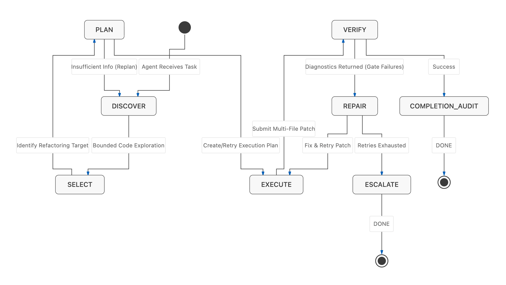
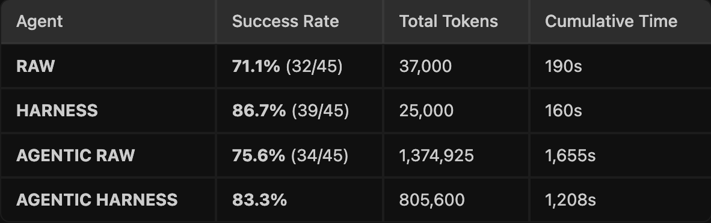

# Refactorika — Devpost

## Inspiration

According to Stripe's **Developer Coefficient** — a study conducted with Harris Poll across thousands of engineers and C-suite executives in 30+ industries — **42% of every developer's working week** is spent dealing with technical debt and bad code. That's nearly **$85 billion** in lost productivity every year, not from building the wrong things, but from fighting the accumulated mess in codebases that already exist.

Every codebase we've worked on has the same graveyard: god-files no one touches, duplicate logic scattered across five modules, functions that were "temporary." Linters tell you *what's* wrong but not *how* to fix it. AI suggests restructuring, but is disconnected from the filesystem, hallucinates edits that don't apply, misses call sites, and forgets everything the moment the session ends.

We wanted a tool that could **act** — read the code, propose a structural change, apply it, *prove it's safe*, and remember what it did. Something that makes mechanical cleanup as frictionless as running a linter. The hard lesson behind Refactorika: **an LLM is brilliant at deciding *what* to refactor and dangerous at *doing* it.** So we split the job — and that split is the whole product.

> **The LLM reasons about *what* and *how*. Deterministic refactoring tools do the actual transformation, reference-correctly. A verification gate proves nothing broke — or reverts it.**

## What it is

**Refactorika is an agent harness delivered as an MCP server, riding on a deterministic, graph-driven refactoring engine.** It plugs Claude directly into your codebase, gives it a reference-correct model of the whole program to reason over, and routes every change it proposes through real refactoring tools and a verification gate stack — so cleanups land *proven safe* or not at all.

```bash
claude mcp add refactorika -- uvx refactorika serve
```

It gives every repo the four capabilities they desperately need:

- **Organization** — splits god-files into coherent modules, reorders and deduplicates imports (stdlib → third-party → local), extracts helpers from bloated call sites.
- **Complexity reduction** — breaks long functions into named units, flattens deep nesting with guard clauses, replaces repeated blocks with parameterized helpers.
- **Duplicate & dead-code removal** — finds structural clones via AST fingerprinting and semantic near-clones via vector embeddings, then finds functions nothing reaches via call-graph reachability. **Every removal goes through verification before it lands.**
- **Living documentation** — generates and self-updates `.refactorika/context/<module>.md` files that compound across sessions, so the *why* doesn't evaporate when people leave.

Three ways to run it, all over **one verified spine**: the **MCP server** (drive it from Claude), the **engine CLI** (`refactorika <dir>`), and the **agent campaign** (`--agents`: audit → dependency-ordered plan → specialist agents).

## How it works — the pipeline

The whole design is a hard line between **AI judgment** and **deterministic execution**. The LLM never edits a file; it emits a typed `TransformSpec`. Real tools execute it. Gates decide whether it lives.

**1 · The graph — reference-correct understanding.**
We build a whole-program symbol graph with **Jedi**'s real static name resolution. Nodes are functions/classes/methods; edges are *true* references resolved through imports, aliases, and scopes — **not** a regex name match. This is the make-or-break: it's why a rename updates *every real reference and nothing that merely shares the name*, and why dead-code analysis (reachability from entry points like public API, `__all__`, `__main__`, tests, and route/fixture decorators) is trustworthy. The graph also gives us **leaf-to-root ordering** (refactor on top of already-verified code) and **impact analysis** (the exact set a change can affect → we re-run only the *impacted* tests).

**2 · The plan — where the LLM reasons.**
The planner finds real smells — god functions detected by a *three-axis cohesion signal* (cyclomatic complexity ≥ 6 **or** length ≥ 30 lines **or** nesting ≥ 4, not a naive line count), duplicates, dead code — and asks the model *how* to fix them. The model returns a `TransformSpec` (parameters), never a diff. Before deciding, it **recalls the most semantically similar prior decision** from memory and reuses the same helper names, so the 2nd, 5th, Nth similar function is refactored *consistently*.

**3 · The engines — real refactoring tools do the work (deterministic).**

| What | Tool |
|---|---|
| Cross-file **rename** | **rope** — reference-correct, updates every call site & import |
| **Cleanup** (unused imports, simplifications, format) | **autoflake** + **ruff** |
| **Dead-code removal** | **LibCST** — surgical node removal, preserves formatting/comments |
| **Decompose / extract** | **LibCST** — AST-node replacement |

These are battle-tested engines, not LLM text edits — so a cross-file rename is *provably complete* in a way prompting never is. Each returns an `EditMap` (`{path: contents}`) and **touches nothing on disk** — the gate stack owns disk and git.

**4 · The verification gate stack — determinism's teeth.**
Every edit passes a cheapest-first, short-circuiting pipeline. Tools are the arbiter; *no LLM decides whether an edit is safe.*


- **parse** (tree-sitter, before touching disk) →
- **lint** (`ruff`, rejects only *new* violations vs. a pre-edit baseline) →
- **type** (`pyright`, only *new* errors — touching a file with pre-existing noise won't spuriously fail) →
- **behavior** (`pytest`, scoped to the *impacted* tests; no test coverage is recorded as a `skip`, **never** a silent pass).

All green → **`git commit`** (one atomic commit per verified edit). Any red or crash → **byte-for-byte restore**. The full suite runs once at **baseline** (the repo must start green) and once at the **finale** ("all N still pass") as the authoritative backstop.

**5 · The agent harness — bounded, self-repairing autonomy.**
The agent campaign drives the whole loop as an explicit state machine: discover the target with bounded exploration, select a change, execute a multi-file patch, verify it, and on gate failure **repair-and-retry** — escalating to `skipped-needs-human` rather than ever force-committing.



**6 · Memory — Redis Iris, decision memory not a cache.**
Every refactoring decision (the pattern it acted on → the transform → the names chosen) is stored, keyed by an **embedding of the code**, so the engine stays consistent across a whole repo. This is one of four Redis Iris subsystems (below). Kill Redis and everything degrades transparently to local JSON — the engine never *depends* on it.

## Tech stack

**Core engine & the program graph**
- **Python 3.11+**
- **Jedi** — real static name binding → the reference-correct symbol graph (replaced a regex call-graph that mislinked same-named symbols)
- **tree-sitter + tree-sitter-python** — AST parsing, the parse gate, structural fingerprints, nesting depth
- **FastMCP** — MCP server framework (12 tools, JSON in/out)
- **Typer** — the engine CLI shell

**Deterministic refactoring tools**
- **rope** — reference-correct cross-file rename/move
- **LibCST** — lossless AST-node replacement (decomposition) + surgical dead-code removal
- **ruff + autoflake** — deterministic cleanup
- **radon** — complexity metrics + god-function detection

**Verification gates**
- **ruff** — lint + format normalization (new violations only)
- **pyright** — type checking (new errors only, vs. pre-edit baseline)
- **pytest** — behavior gate, impact-scoped; exit 5 (no tests) recorded as a `skip`, never a silent pass
- **git** — atomic commit per verified edit; rollback via byte-for-byte snapshot restore

**Duplicate & dead-code detection**
- **tree-sitter AST fingerprinting** — exact structural clones
- **OpenAI `text-embedding-3-small`** (+ **sentence-transformers** keyless fallback; provider-agnostic, also Ollama) — semantic near-clone detection
- **Redis `FT.HYBRID`** (BM25 + vector, RRF-fused) — hybrid search; strictly better than pure cosine on code
- **Custom call-graph reachability** — dead-symbol detection with confidence levels

**Memory — Redis Iris**
- **Redis 8+** (local Docker `redis:8` / redis-stack for the Query Engine) — primary state backend
- **RedisVL** — vector index + hybrid search client
- **Four subsystems:** AST-keyed **LangCache** · **Hybrid Search Index** (`FT.HYBRID`, RRF) · **Agent Memory** (cross-session decisions + history) · **Context Retriever** (hybrid + tag filters)
- **Graceful fallback** to local `.refactorika/` JSON + brute-force vectors when Redis is unavailable

**Provider-agnostic LLM**
- Generation (**Anthropic Claude** | **Ollama**) and embeddings (**sentence-transformers** | **Ollama** | **OpenAI**) are *separate* providers — Anthropic has no embeddings API, so the embedding backend works regardless of the generation provider. A **record/replay cache keyed by (provider, model, prompt)** makes any run reproducible.

**Language support**
- **`LanguageAdapter` registry** — per-language parse/lint/typecheck dispatch. Python: full gate stack. Any other language: gates skip (recorded as `null`), the test suite still runs. TypeScript/Go adapters drop in via optional deps, no core changes.

**Infrastructure**
- **Git** — atomic commits + snapshot rollback · **.env / .env.example** — secrets, never committed

## Benchmarking — does the harness actually help?

We measured it the only honest way: **the same agent, with the harness OFF vs ON**, graded by an **independent oracle** (the repo's own tests), not by the harness itself.



- **Simple proposer:** harness lifts success **71.1% → 86.7%** (32/45 → 39/45) — *and* spends **fewer tokens** (37k → 25k) and **less time** (190s → 160s). Safety that's also cheaper.
- **Full agentic loop:** harness lifts **75.6% → 83.3%** while **cutting tokens 1.37M → 806k** and time **1,655s → 1,208s** — the verified spine keeps the agent from thrashing.

We also run on **RefactorBench** (microsoft/RefactorBench — 100 real multi-file refactoring tasks across Django, FastAPI, Celery, Scrapy, Salt, Ansible, Requests, Flask, Tornado, each verified by its own AST tests). Refactorika has a *fixed* transform menu, so we **decline out-of-scope tasks explicitly** rather than hallucinate, and report **three honest numbers** — in-scope pass rate, in-scope subtask completion, and out-of-scope count — never a single inflated figure. (Baseline LM agents solve ~22% of RefactorBench; it's a credibility signal, not an ace-it target.)

## Challenges we ran into

**The verification paradox.** A change that looks clean to `pyright` can still silently break behavior. Getting `pytest` to run scoped to the *impacted* tests (fast enough to feel interactive), making the type/lint gates **baseline-aware** (reject only *new* errors, so touching a file with pre-existing noise doesn't revert a good edit), and handling missing coverage honestly (record a `skip`, never a silent pass) took real iteration. `skipped-needs-human` was a deliberate line: **never force-commit, never pretend a gate passed that didn't run.**

**Reference-correctness on real repos.** This is the make-or-break. A regex call-graph cheerfully renames a same-named-but-unrelated symbol; rope crashes on intentionally-broken fixtures (Django ships syntax-error test files); the dead-code locator initially only found `def`/`class`, missing renamed constants. Real codebases are far messier than toy examples — we moved to Jedi binding for the graph and hardened every tool against the mess.

**Refactoring should make code *less*, not more.** Our first LLM pass naively decomposed every long function and *added* hundreds of lines. "Decompose" is a structural trade, not a reduction — so we rebuilt god-function detection around a three-axis cohesion signal and biased the planner toward reduction (dead code, dedup, cleanup) over restructuring.

**Duplicate detection at the right granularity.** Structural fingerprinting catches exact clones; semantic embeddings catch near-clones. Tuning the threshold to surface *actionable* duplicates without drowning in false positives (getter/setter pairs *should* look similar) required calibrating against real messy repos.

**Redis Iris offline fallback.** We wanted Redis Iris as the primary memory layer but needed the demo to run anywhere — including a laptop with no network. Building a fallback that's genuinely transparent (same interface, same behavior, just slower and non-persistent) without a maintenance split was harder than expected.

**Tree-sitter sees syntax, not semantics.** Call-graph reachability works for direct calls but misses dynamic dispatch, decorators that register functions implicitly, and `__all__` exports. We set explicit confidence levels and surface uncertainty rather than silently over-delete.

## What we learned

The hardest part of a safety-first refactoring tool isn't the refactoring — it's **the division of labor**. The LLM is the right tool for *judgment* (what's worth changing, how to name the pieces) and the wrong tool for *execution* (it can't guarantee a rename is complete). Deterministic engines are the reverse. Put the model in charge of "what," rope/LibCST in charge of "how," and the test suite in charge of "is it still correct" — and you get something you can actually trust. We also had to define "safe" precisely enough to enforce mechanically: malformed output (parse), style drift (ruff), type regression (pyright), and behavior change (pytest) are four different failures that need four different responses.

And we learned that **visible checking *is* the product.** An agent that silently refactors and hands you a diff to trust is just a faster way to introduce bugs. Rendering the gate log — especially the catch-and-rollback moment — is what turns "AI did something to my code" into "I watched it get checked."

## What's next for Refactorika

- **Broader duplicate consolidation** — the flow surfaces duplicates and proposes a merge today; we want to close the loop by auto-generating the unified implementation and running it through the full gate stack (rope already does reference-correct moves; we're wiring `consolidate` as a first-class transform).
- **Richer dead-code analysis** — handle dynamic dispatch, decorator-registered entry points, and `__all__`-exported symbols more precisely to push confidence levels up.
- **Per-module context cards** — `generate_docs` already emits `.refactorika/context/` files; make them queryable via `get_context_map` so Claude can answer "why does this module look this way?" with grounded, session-persistent memory.
- **More languages** — the `LanguageAdapter` registry already abstracts parse/lint/typecheck; TypeScript and Go gates drop in as optional deps, no core changes.

## Built with

`python` · `jedi` · `rope` · `libcst` · `tree-sitter` · `ruff` · `autoflake` · `pyright` · `pytest` · `radon` · `redis` · `redisvl` · `fastmcp` · `anthropic` · `ollama` · `openai` · `sentence-transformers` · `typer` · `git`
