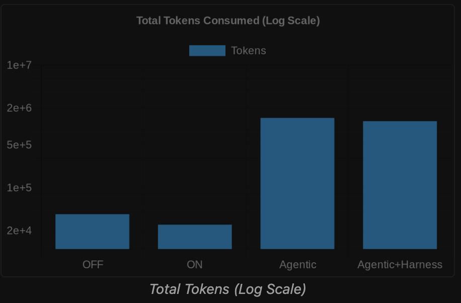
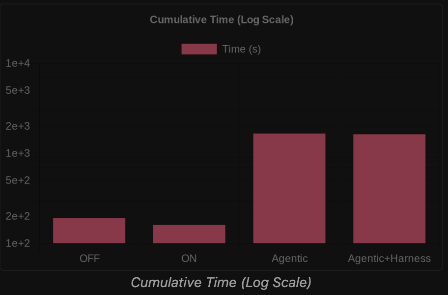

# Refactorika — Complete Project Documentation

> The master reference for the whole project: problem, solution, architecture, the pipeline, every
> pillar (graph · determinism · multi-agents · Redis Iris · embeddings · Sentry), the tech stack,
> the benchmarks, how to run it, and **how to present it**. This consolidates both lineages — the
> `main` branch (agent harness, MCP tools, Redis Iris, multi-agent campaign, Sentry) and the
> `v3-refactoring-engine` branch (the deterministic, graph-driven engine) — which are now merged
> into one system. Where this disagrees with the code, the code wins (`refactorika/`).

---

## 0. The one-paragraph version

**Refactorika is an agent harness, delivered as an MCP server, riding on a deterministic
graph-driven refactoring engine.** It plugs Claude into your codebase, gives it a reference-correct
model of the whole program to reason over, and routes every change through *real refactoring tools*
and a *verification gate stack* — so cleanups land **proven safe** or get reverted. The thesis is a
hard line between AI judgment and deterministic execution:

> **The LLM reasons about *what* to refactor and *how*. Deterministic tools (rope, LibCST) do the
> actual transformation, reference-correctly. A verification gate (parse → ruff → pyright → pytest)
> proves nothing broke — or rolls it back byte-for-byte. Redis Iris remembers every decision so the
> work stays consistent across the whole repo.**

---

## 1. The Problem

According to Stripe's **Developer Coefficient** (with Harris Poll, thousands of engineers across
30+ industries), **42% of every developer's week** goes to technical debt and bad code — roughly
**$85 billion/year** in lost productivity, spent not building the wrong things but fighting the mess
in codebases that already exist.

Every repo rots the same four ways:

1. **Poor organization** — god-files, scattered/duplicate imports, bloated call sites.
2. **Rising complexity** — long functions, deep nesting, tangled control flow.
3. **Context & documentation rot** — the *why* evaporates as people leave; new engineers play
   "software archaeologist" with `git blame`, terrified to touch a silent dependency.
4. **Duplicate & dead code** — the same logic written five ways; functions nothing reaches. Fixing a
   bug in one copy doesn't fix the other four.

**Why existing tools don't solve it.** Linters (`ruff`, `flake8`) tell you *what's* wrong, not *how*
to restructure. Type checkers surface errors but don't reorganize. AI chat suggests refactors but is
disconnected from the filesystem — copy/paste hell — **hallucinates edits that don't apply, misses
call sites, silently changes behavior, and has no memory**: every session starts from zero.

The hard truth we built around: **an LLM is brilliant at deciding *what* to refactor and dangerous
at *doing* it.** Ask it to rename a function repo-wide and it'll miss a call site or touch a
same-named-but-unrelated symbol. So we stopped asking it to edit files.

---

## 2. The Solution

Split the job, and give each part to the tool that's actually good at it:

| Job | Owner | Why |
|---|---|---|
| **What** to change, **how** to name it | **The LLM (Claude)** | judgment, semantics, naming — genuinely hard for rules |
| **Doing** the transformation, reference-correctly | **Deterministic engines** (rope, LibCST, ruff) | provably complete; an LLM can't guarantee a rename is total |
| **Is it still correct?** | **The verification gate stack** (tools) | type-clean ≠ behavior-preserving; only tests prove safety |
| **Stay consistent across the repo** | **Redis Iris memory** | recall prior decisions; reuse names; compound knowledge |

The result is a tool you can actually trust: **the engine restructured it, but nothing landed
unverified** — and you can *watch* it get checked.

---

## 3. System Architecture (both branches, merged)

Refactorika is **one verified spine with three execution surfaces** layered on top. The merge brought
`main`'s *agentic / analysis* design alongside the branch's *graph-driven engine*; they now coexist.

```
                         ENTRY POINTS
        refactorika CLI                         MCP server (python -m refactorika.mcp_server)
        (refactorika/cli.py)                    (FastMCP — 12 tools, JSON in/out)
              │                                          │
   ┌──────────┼───────────────┐              ┌───────────┼──────────────────┐
   │          │               │              │           │                  │
 (default)  --agents      --show-*        run_pipeline  run_agents     analysis tools
   ▼          ▼                              ▼           ▼                  ▼
SURFACE A   SURFACE C                     (engine)    (agents)         SURFACE B
THE ENGINE  THE AGENT CAMPAIGN                                         ANALYSIS / MCP TOOLS
pipeline/   agents/ + analysis/audit                                  analysis/ + core/analyze
   │          │                                                          + core/apply + docs_gen
   └────┬─────┘
        ▼
   transforms/* (pure EditMap) ─────────► THE VERIFIED SPINE ◄── core/apply.py (single-file path)
                                          pipeline/checker.py
                                          parse → ruff → pyright → pytest (impact-scoped)
                                          → git commit (green) / byte-for-byte revert (red)
                                                  │
                                          core/storage.py ── Redis Iris (primary) | JSON (fallback)
                                          memory/* (decision memory, hybrid vectors, codebase index)
```

- **Surface A — the engine** (`pipeline/orchestrator.run_pipeline`): graph-driven, deterministic +
  optional LLM judgment, leaf-to-root, impact-scoped. The newest, most-tested path.
- **Surface B — analysis & MCP tools**: the read-only analyzers (`analyze_file`, `find_duplicates`,
  `find_related`, `find_dead_code`, `generate_docs`, `get_context_map`, `audit_repo`, `get_plan`,
  `confirm_plan`, `get_log`) plus the gated `apply_and_verify` / `apply_and_verify_multi`. Exposed
  over MCP so Claude can reason and propose.
- **Surface C — the agent campaign** (`agents/orchestrator`): `audit → dependency-ordered plan →
  specialist agents`, each routed through the verified spine.

All three commit through **git** and persist state to **Redis Iris** (or the JSON fallback).

---

## 4. The Pipeline — end to end

A run moves through six stages. The boundary between *AI judgment* and *deterministic execution* is
hard at every step.

**1 · Build the graph** (`graph/resolver.py`, **Jedi**) — a reference-correct whole-program symbol
graph (see §5.1).

**2 · Plan** (`pipeline/planner.py` + `planner_llm.py`) — the deterministic plan (dead-code +
cleanup) plus optional **LLM judgment**: detect god functions by a *three-axis cohesion signal*
(complexity ≥ 6 **or** length ≥ 30 lines **or** nesting ≥ 4 — not a line count), ask the model *how*
to decompose, and **recall the most similar prior decision** to reuse helper names. The LLM emits a
typed `TransformSpec` (parameters), **never a diff**.

**3 · Execute with real tools** (`transforms/*`) — each engine takes a `TransformSpec`, returns an
`EditMap` (`{path: contents}`), and **touches nothing on disk** (see §5.2).

**4 · Verify, then commit or revert** (`pipeline/checker.py`) — the gate stack runs cheapest-first,
short-circuiting; green → `git commit`, red → byte-for-byte restore (see §5.2).

**5 · Remember** (`memory/decision_memory.py`) — record the decision keyed by an embedding of the
code, for cross-file consistency (see §5.4).

**6 · Repeat to a fixpoint** — rebuild the graph (positions shifted after the edit), take the next
item, cascade dead-code removal until reachability is stable. The full suite gates the run at
**baseline** (must start green) and **finale** ("all N still pass").

---

## 5. The Pillars (deep dives)

### 5.1 The Graph — reference-correct understanding

Refactoring is a **whole-program graph problem**, not a per-file one: the dangerous changes (rename,
move, dedup, dead-code removal) are about *relationships between files*.

- **Built with Jedi** real static name resolution. Nodes are functions/classes/methods; edges are
  *true* references resolved through imports, aliases, and scopes — **not** a regex name match. This
  replaced an earlier regex call-graph that would cheerfully rename a same-named-but-unrelated symbol.
- **Entry points** flagged textually: public top-level symbols, `__all__`, names called under
  `if __name__ == "__main__"`, test files / `test_*`, and route/command/fixture/task decorators.
- **`topo_order`** — Tarjan SCC condensation, then leaf-first emission: refactor on top of already-
  verified code; cycles are reported as groups, not guessed.
- **`impact_of(symbol)`** — reverse reachability: the exact set of things a change can affect → we
  re-run **only the impacted tests** per edit (the efficiency win).
- **`reachable_from(entry_points)`** — forward reachability; the complement is the dead-code
  candidate set, ranked with confidence.

> Why it's the make-or-break: every downstream guarantee (a rename hits *every* real reference and
> *nothing* that merely shares the name; dead-code is genuinely dead) rests on the graph being
> reference-correct.

### 5.2 Determinism — real tools + the verification gate stack

**The engines do the work — not the LLM.** Each is pure: takes a `TransformSpec`, returns an
`EditMap`, never writes to disk (the checker owns disk + git).

| Transform | Engine | Tool |
|---|---|---|
| Cross-file **rename** | `rename.py` | **rope** — reference-correct, updates every call site & import |
| **Cleanup** (unused imports, simplify, format) | `cleanup.py` | **autoflake** + **ruff** |
| **Dead-code removal** | `dead_code.py` | **LibCST** — surgical node removal, preserves formatting |
| **Decompose / extract** | `node_replace.py` | **LibCST** — AST-node replacement |

These are battle-tested refactoring engines, so a cross-file rename is *provably complete* in a way
prompting never is.

**The verification gate stack** (`pipeline/checker.py` / `core/apply.py`) is determinism's teeth.
Every edit passes a cheapest-first, short-circuiting pipeline — *tools are the arbiter, no LLM decides
safety*:


1. **parse** — tree-sitter, before touching disk (reject malformed output).
2. **lint** — `ruff`, rejects only *new* violations vs. a pre-edit baseline.
3. **type** — `pyright`, only *new* errors (touching a file with pre-existing noise won't spuriously
   fail).
4. **behavior** — `pytest`, scoped to the *impacted* tests; no coverage is recorded as a `skip`,
   **never** a silent pass.

All green → **`git commit`** (one atomic commit per verified edit). Any red or crash → **byte-for-byte
restore**. We distinguish four failure modes deliberately — malformed (parse), style drift (ruff),
type regression (pyright), behavior change (pytest) — because collapsing them into one "verification
failed" would make the tool useless for understanding *why* an edit didn't land. The honest
`skipped-needs-human` status is a hard line: **never force-commit, never pretend a gate passed that
didn't run.**

### 5.3 The Multi-Agent System — bounded, self-repairing autonomy

The agent campaign (`--agents` / the `run_agents` MCP tool) turns the whole loop into an explicit,
auditable state machine, then dispatches to specialist agents.


- **Campaign flow** (`agents/orchestrator.run_campaign`): `analysis/audit.build_plan` (repo audit →
  **dependency-ordered plan**, fewest-dependents-first) → auto-confirm → `dispatch_plan`.
- **Per task**: the orchestrator builds the graph and one shared `Checker`, then routes to a
  specialist by the task's dominant kind:

| Agent | What it does |
|---|---|
| **ComplexityAgent** | LLM god-function decomposition → deterministic engine → verified `Checker` (impact-scoped) |
| **DeadCodeAgent** | deterministic dead-code removal through the gate stack |
| **ImportAgent** | deterministic import reordering/dedup (stdlib → third-party → local) |
| **DuplicateAgent** | surfaces duplicate pairs + proposes a consolidation target |

- **The loop** (per IMG_2540): **DISCOVER** the target with *bounded* code exploration → **SELECT** a
  change → **EXECUTE** a multi-file patch → **VERIFY** through the gate stack → on gate failure
  **REPAIR** with structured diagnostic feedback and retry → on success **COMPLETION_AUDIT** → and
  when retries are exhausted, **ESCALATE** to a human rather than ever force-committing.

The design separates *loop value* from *harness value* — which the benchmark (§7) measures directly.

### 5.4 Redis Iris — the memory layer (the differentiator)

Most refactoring tools are stateless. Refactorika's edge is **memory that compounds across runs and
sessions.** Redis Iris is used as **four cooperating subsystems** (via **RedisVL**), each with a
transparent local-JSON fallback so everything runs offline.

```
┌──────────────────────────────────────────────────────────────────┐
│                    Redis Iris  (via RedisVL)                       │
│  ① LangCache / AST cache        ② Hybrid Search Index             │
│     skip re-parse (exact key)      per fn: vector + BM25 + tags    │
│                                    FT.HYBRID (RRF-fused)            │
│  ③ Agent Memory (long-term)     ④ Context Retriever               │
│     module ctx · decisions ·       hybrid + tag/num filters        │
│     refactor history (x-session)   "3 most relevant for module"    │
│                                                                    │
│  Local fallback: .refactorika/state.json · context/<module>.md     │
└──────────────────────────────────────────────────────────────────┘
```

1. **LangCache / AST-keyed cache** — never analyze the same code twice. Results are memoized on a
   **normalized AST signature** (exact key, *not* fuzzy — a fuzzy hit would hand back the wrong file's
   smells and corrupt accuracy).
2. **Hybrid Search Index** — each function is a Redis doc with a **vector** (OpenAI embedding, HNSW
   cosine), a **text** field (signature+body+identifiers, BM25-scored), and **tag/numeric** fields
   (`file`, `module`, arity, AST fingerprint). `find_duplicates` runs **`FT.HYBRID`**: BM25 *and*
   vector in one call, **RRF-fused**. (See §5.5 for why hybrid beats pure cosine on code.)
3. **Agent Memory (long-term, cross-session)** — module context (from `generate_docs`), architectural
   decisions, and the `EditRecord` refactor history; the second run on a repo retrieves prior context
   and works **incrementally** instead of from scratch.
4. **Context Retriever** — feeds Claude exactly the relevant prior knowledge (hybrid retrieval + tag
   filters: "the 3 most relevant entries for *this* module"), grounding proposals in established
   conventions without loading the whole repo.

**Decision memory** (the engine's use of subsystem ③): every refactoring decision (pattern → transform
→ helper names chosen) is stored keyed by an embedding of the code, and **recalled by semantic
similarity** (exact structural shape first, then vectors above a 0.86 cosine threshold) so the 2nd,
5th, Nth similar function is refactored *consistently*. Inspect it with `--show-memory` or live in
**Redis Insight**.

> **Runs anywhere:** with `FT.HYBRID` (Redis 8.4+ Query Engine, e.g. Docker `redis:8` / redis-stack)
> you get true hybrid search; on plain Redis or fully offline it degrades to a brute-force vector
> scan over local JSON — same correctness floor, just slower and without BM25 fusion. **Redis is an
> optimization, never a hard dependency.**

### 5.5 Embeddings & Hybrid Search

- **Provider-agnostic embeddings**: **OpenAI `text-embedding-3-small`** (primary), **sentence-
  transformers** (local, keyless fallback), or **Ollama** — *separate* from the generation provider
  (Anthropic has no embeddings API), so the embedding backend works regardless of which LLM generates.
- **Why hybrid, not pure vector — the whole point.** Semantic-only embeddings are weak on *code*: two
  unrelated helpers can be cosine-close, and embeddings struggle with precise identifiers (API/function
  names) that need exact matching. Lexical-only (BM25) misses "same logic, different names." Fusing
  them is strictly better — Redis reports hybrid retrieval lifts recall **3–3.5×** and end-to-end
  accuracy **+11–15%** vs. single-mode. The vector half catches renamed-but-equivalent logic; BM25
  anchors on shared identifiers; **RRF** blends them.
- **Three duplicate-detection signals, not one:** (1) structural AST fingerprint (exact/near-exact
  clones, zero false positives); (2) the hybrid index (meaning ⊕ identifiers); plus the call graph for
  impact. Thresholds tuned on real embeddings (`find_duplicates` ~0.55, `find_related` ~0.5 — code
  near-duplicates score lower than prose).
- **Codebase index** (`memory/codebase_index.py`) embeds *every* symbol into a namespaced Redis vector
  space and feeds the decompose prompt **real neighbor context** (`--show-similar`).

### 5.6 Observability — Sentry

`observability.py` is a **privacy-safe, fail-open** Sentry integration:

- **Errors-only** (`traces_sample_rate=0.0`), `send_default_pii=False`, local variables excluded.
- **`scrub_event`** strips anything that could leak prompts, source, patches, paths, or secrets —
  only an allow-list of fields/tags (`arm`, `case`, `component`, `gate`, `model`, `provider`,
  `phase`, `status`, `run_id`, `git_revision`, …) survives; exception messages/stacktraces are
  redacted to a type.
- **Fail-open:** if the SDK is missing or `SENTRY_DSN` is unset, every call is a no-op — *observability
  must never break product behavior.*
- **Benchmark regression alerts:** `capture_benchmark_regression` emits one sanitized warning when the
  harness-`on` arm's correct-landed rate drops past a threshold or ships any regression — turning the
  benchmark into a guardrail, not just a report.

### 5.7 Provider-agnostic LLM harness & Language adapters

- **Generation** (Anthropic Claude | Ollama) and **embeddings** (above) are independently swappable by
  env (`REFACTORIKA_LLM_PROVIDER`, `REFACTORIKA_EMBED_PROVIDER`). A **record/replay cache keyed by
  (provider, model, prompt)** makes any run reproducible and lets a recorded run replay offline.
- **`LanguageAdapter` registry** — per-language parse/lint/typecheck dispatch. Python gets the full
  gate stack; any other language skips gates (recorded as `null`) while the test suite still runs;
  TypeScript/Go adapters drop in via optional deps, no core changes.

---

## 6. Tech Stack

| Layer | Tools |
|---|---|
| **Language** | Python 3.11+ |
| **Program graph** | **Jedi** (real name binding) · **tree-sitter** + tree-sitter-python (AST, parse gate, fingerprints, nesting) |
| **Deterministic transforms** | **rope** (reference-correct rename/move) · **LibCST** (node replacement, dead-code removal) · **ruff** + **autoflake** (cleanup) · **radon** (complexity / god-function detection) |
| **Verification gates** | **ruff** (lint, new-only) · **pyright** (types, new-only) · **pytest** (behavior, impact-scoped) · **git** (atomic commit / rollback) |
| **LLM (generation)** | **Anthropic Claude** \| **Ollama** — record/replay cache, provider-agnostic |
| **Embeddings** | **OpenAI text-embedding-3-small** \| **sentence-transformers** \| **Ollama** (separate from generation) |
| **Memory — Redis Iris** | **Redis 8.4+** (Query Engine, `FT.HYBRID`) · **RedisVL** · 4 subsystems (LangCache · Hybrid Index · Agent Memory · Context Retriever) · JSON fallback |
| **Front doors** | **FastMCP** (MCP server, 12 tools) · **Typer** (CLI) · agent campaign |
| **Observability** | **Sentry** (privacy-safe, fail-open, errors + benchmark regressions) |
| **Infra** | **Docker** (Redis) · **git** · `.env` secrets (never committed) |

---

## 7. Benchmarks — does the harness actually help?

We measure the only honest way: **the same agent, harness OFF vs ON**, graded by an **independent,
held-out oracle** (the repo's own behavior + structural tests), never by the harness itself. The
**four-arm contract** is frozen:

| Arm | Agent loop | Refactorika harness |
|---|---:|---:|
| `off` (RAW) | No | No |
| `on` (HARNESS) | No | **Yes** |
| `agentic` (AGENTIC RAW) | **Yes** | No |
| `agentic+harness` (AGENTIC HARNESS) | **Yes** | **Yes** |

This separates *loop value* from *harness value*. Every arm shares the model, temperature, repo copy,
prompt, and hidden grader.


- **Simple proposer:** the harness lifts success **71.1% → 86.7%** (32/45 → 39/45) — *and* spends
  **fewer tokens** (37k → 25k) and **less time** (190s → 160s). Safety that's also cheaper.
- **Full agentic loop:** the harness lifts **75.6% → 83.3%** while **cutting tokens 1.37M → 806k** and
  time **1,655s → 1,208s** — the verified spine keeps the agent from thrashing.




**RefactorBench** (microsoft/RefactorBench — 100 real multi-file tasks across Django, FastAPI, Celery,
Scrapy, Salt, Ansible, Requests, Flask, Tornado, each verified by its own AST tests) is the external
credibility signal. Refactorika has a *fixed* transform menu, so we **decline out-of-scope tasks
explicitly** rather than hallucinate, and report **three honest numbers** — in-scope pass rate,
in-scope subtask completion, and out-of-scope count — never a single inflated figure. (Baseline LM
agents solve ~22% of RefactorBench; it's a credibility signal, not an ace-it target.)

---

## 8. How to run it

```bash
# Setup
python3 -m venv .venv && .venv/bin/python -m pip install -e ".[dev]" ".[semantic]"
docker compose up -d redis            # redis-stack (FT.HYBRID + Insight UI on :8001); optional

# A — the engine CLI (dry-run on a temp copy; nothing changes until --apply)
.venv/bin/refactorika <dir>                       # plan + verified edits + before/after metrics
.venv/bin/refactorika <dir> --show-graph          # symbol graph, entry points, dead code
.venv/bin/refactorika <dir> --show-plan           # leaf-to-root worklist
.venv/bin/refactorika <dir> --show-memory         # stored RefactorDecisions
.venv/bin/refactorika <dir> --rename mod.foo=bar  # reference-correct cross-file rename
.venv/bin/refactorika <dir> --llm                 # + LLM decomposition (needs ANTHROPIC_API_KEY)
.venv/bin/refactorika <dir> --apply               # write in place; one git commit per verified edit

# C — the agent campaign (audit → plan → specialists, applied + verified)
.venv/bin/refactorika <dir> --agents

# B — the MCP server (drive from Claude)
claude mcp add refactorika -- .venv/bin/python -m refactorika.mcp_server

# Benchmarks
make eval-inscope            # RefactorBench in-scope tasks
make benchmark-full-agent    # four-arm OFF/ON/agentic/agentic+harness
```

Key env (`.env`, gitignored): `REDIS_URL`, `ANTHROPIC_API_KEY`, `OPENAI_API_KEY`,
`REFACTORIKA_LLM_PROVIDER`, `REFACTORIKA_EMBED_PROVIDER`, `SENTRY_DSN`. The engine never *depends* on
the LLM or Redis being reachable — both degrade gracefully.

---

## 9. Presentation Flow (how to tell the story)

A tight ~5–7 minute arc. Each beat has a purpose; the demo is the spine.

**Beat 1 — The hook (30s): the $85B problem.** Open on the Stripe stat — 42% of every dev's week,
$85B/year, fighting code that already exists. "Linters tell you what's wrong, not how to fix it. AI
suggests fixes but can't safely apply them and forgets everything. We built the tool that *acts* —
and proves it's safe."

**Beat 2 — The thesis (30s): the division of labor.** One line, the whole product: *the LLM reasons
about what to refactor; deterministic tools do the actual work; a verification gate proves nothing
broke.* This reframes "AI that edits your code" (scary) into "AI that decides, tools that execute,
tests that verify" (trustworthy).

**Beat 3 — The graph (45s): why it's correct.** Show `--show-graph` on a real repo. "Before we change
anything, we build a reference-correct model with Jedi — so a rename hits *every* real reference and
*nothing* that merely shares the name. This is the thing chat-AI can't do." Show a cross-file
`--rename` landing across multiple files.

**Beat 4 — The money-shot (90s): visible verification.** This is the emotional peak. Run a real
refactor and **show the gate log** (the gate-stack diagram on a slide behind it): parse → ruff →
pyright → **pytest**. Then **plant a behavior-breaking edit** and watch the pytest gate catch it and
**roll it back byte-for-byte** — then the agent **repair-and-retry**. "Type-clean isn't safe; only the
tests are. An agent that silently hands you a diff is a faster way to ship bugs. We let you *watch it
get checked.*"

**Beat 5 — The agents (45s): bounded autonomy.** Show the state-machine diagram (IMG_2540) and run
`--agents`: audit → dependency-ordered plan → specialists (complexity, dead-code, imports,
duplicates), each verified, with `skipped-needs-human` instead of force-commits.

**Beat 6 — Redis Iris (60s): memory that compounds.** Open **Redis Insight**. Show the four subsystems
live: the hybrid `FT.HYBRID` index catching a *semantic* duplicate (renamed-but-equivalent logic that
pure cosine misses), and `--show-memory` proving the engine reused a prior decision's helper names so
two similar functions were refactored *the same way*. "This is Redis as live decision memory, not a
cache — and it runs offline if Redis is down."

**Beat 7 — The proof (45s): the benchmark.** Show bench4. "Same agent, harness OFF vs ON: **71% →
87%**, and it spends **fewer tokens** and **less time**. On the full agentic loop, the harness cuts
tokens ~40% while raising success. Graded by the repo's own tests, not by us." Mention RefactorBench
and the honest three-number reporting.

**Beat 8 — The close (20s).** "Refactorika makes safe structural change as frictionless as running a
linter — the LLM decides, real tools execute, your tests prove it. `claude mcp add refactorika` and
your codebase cleans itself, verifiably." Land on what's next (consolidation, more languages).

**Slide/asset checklist:** problem stat · the thesis line · `--show-graph` + `--rename` live · the
gate-stack diagram (Screenshot) · the live catch-and-rollback · the agent state machine (IMG_2540) ·
Redis Insight + `--show-memory` · the benchmark table (bench4) + charts (bench2/bench3).

---

## 10. Roadmap (what's next)

- **Broader duplicate consolidation** — close the loop: auto-generate the unified implementation and
  run it through the full gate stack (rope already does reference-correct moves; `consolidate` becomes
  a first-class transform).
- **Richer dead-code analysis** — handle dynamic dispatch, decorator-registered entry points, and
  `__all__` exports to push confidence levels up.
- **Unify the agents onto the engine spine** — route every specialist through `propose_specs` →
  `dispatch` → `Checker` (ComplexityAgent already is).
- **Per-module context cards** — make `generate_docs` output queryable via `get_context_map` so Claude
  answers "why does this module look this way?" with grounded, session-persistent memory.
- **More languages** — TypeScript/Go gate stacks via the `LanguageAdapter` registry, no core changes.

---

## 11. Doc map (where to go deeper)

| Topic | Doc |
|---|---|
| As-built pipeline & code reachability | `pipeline.md` |
| Full system spec + architecture diagram | `v3_spec.md` |
| Redis Iris memory layer (in depth) | `05-redis-iris.md` |
| Every way to run it | `usage.md` |
| Benchmarks & evaluation | `11-benchmarks-and-eval.md`, `13-full-system-benchmark.md`, `15-four-arm-agent-benchmark-contract.md` |
| Devpost submission | `devpost.md` |
| Project memory (orientation) | `../CLAUDE.md` |
